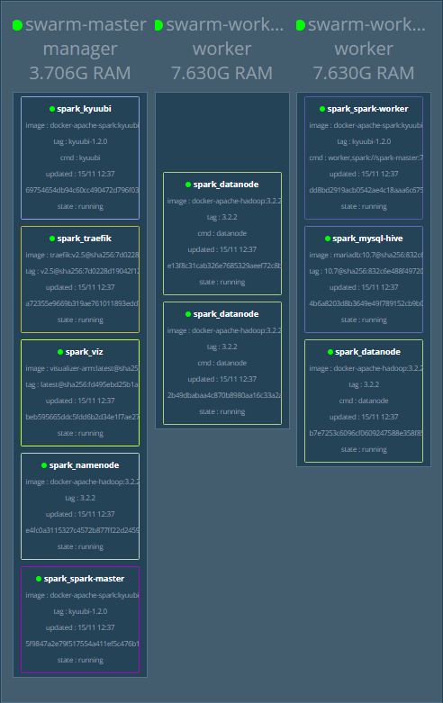

## <p align="center">POC using Apache Spark / Apache Hadoop / Apache Kyuubi / Apache Zeppelin / Hive on MariaDB / Docker Swarm</p>
  
Apache Spark and Kyuubi demo with Hadoop HDFS, Zeppelin notrbook, Hive on Mysql running on docker Swarm as orchestrator.
    
## 🧐 Features    
- Using docker compose version 2
- Traefik as an tcp/http edge proxy
- Apache spark in a hybrid standalone/swarm mode
- Apache Kyuubi to have a secure access through JDBC and SQL queries commands
- Get data access with Zeppelin notebooks
- Apache Hive for table storage in parquet format 
        
## 🛠️ Tech Stack
- [Traefik](https://doc.traefik.io/traefik/)
- [Apache Spark](https://spark.apache.org/)
- [Apache Kyuubi](https://kyuubi.apache.org/)
- [Apache Hadoop](https://hadoop.apache.org/)
- [Apache Hive](https://hive.apache.org/)
- [Apache Zeppelin](https://zeppelin.apache.org/)
- [MariaDB](https://mariadb.org/)

This swarm stack is fully compatible with raspberry PI, base images are also built on ARRCH64 architecture. Here is the visualizer result using 3 raspberry PI4 cluster




        
## 🧑🏻‍💻 Usage
#### Launching using docker compose

```Bash
$ docker compose up --remove-orphans -d && docker compose logs -f
```

#### Launching using docker swarm
```Bash
$ docker stack deploy -c <(docker-compose config) stack-name
```
Launching this docker compose file as-is will create a ingress/mesh network, the traefik edge router will redirect http and tcp request on correct container accordingly.

Opened RPC ports

|Port|Service|
|---|---|
|3306|MariaDB|
|10009|Apache Kyuubi|
|8020|Namenode|
|9866|Datanode|
|7077|Spark master|


## 🛠️ Scaling workers   
```bash
$ docker service scale spark_spark-worker=8
```

## Test on local cluster
Check the **.env** file and search for the environment variables below.
The fastest way is to launch the swarm on a single host like your local computer.
The domain **localtest.me** is pointing on 127.0.0.1, check [documentation here](https://readme.localtest.me/)

- DATANODE1_DNS=datanode1.localtest.me
- DATANODE2_DNS=datanode2.localtest.me
- DATANODE3_DNS=datanode3.localtest.me
- KYUUBI_SPARKUI_DNS=kyuubi_ui.localtest.me
- NAMENODE_DNS=namenode.localtest.me
- NODEMANAGER_DNS=nodemanager.localtest.me
- RESOURCEMANAGER_DNS=resourcemanager.localtest.me
- SPARK_MASTER_DNS=sparkmaster.localtest.me
- SPARK_WORKER_DNS=sparkworker.localtest.me
- VIZ_DNS=viz.localtest.me
- ZEPPELIN_DNS=zeppelin.localtest.me
- ZEPPELIN_SPARKUI_DNS=zeppelin_ui.localtest.me

If you have to made manual configuration, open the **.env** file and modify the  environment variables using simple DNS entries like this: 

- SPARK_MASTER_DNS=sparkmaster
- SPARK_WORKER1_DNS=sparkworker1
- SPARK_WORKER2_DNS=sparkworker2
- SPARK_WORKER3_DNS=sparkworker3
- NODEMANAGER_DNS=nodemanager
- RESOURCEMANAGER_DNS=resourcemanager
- VIZ_DNS=viz
- ZEPPELIN_DNS=zeppelin
- ZEPPELIN_SPARKUI_DNS=zeppelin_ui
- NAMENODE_DNS=namenode
- DATANODE1_DNS=datanode1
- DATANODE2_DNS=datanode2
- DATANODE3_DNS=datanode3

Then set the corresponding swarm cluster manager IP in your **local hosts file**, e.g: 192.168.1.11:2377 as the advertise address

- 192.168.1.11 sparkmaster
- 192.168.1.11 sparkworker1
- 192.168.1.11 sparkworker2
- 192.168.1.11 sparkworker3
- 192.168.1.11 mysql-hive
- 192.168.1.11 nodemanager
- 192.168.1.11 resourcemanager
- 192.168.1.11 viz
- 192.168.1.11 zookeeper
- 192.168.1.11 zeppelin
- 192.168.1.11 zeppelin_ui
- 192.168.1.11 namenode
- 192.168.1.11 datanode1
- 192.168.1.11 datanode2
- 192.168.1.11 datanode3
- 192.168.1.11 resourcemanager

## 🙇 Author
#### JS
- Github: [@jsminet](https://github.com/jsminet)
        
## ➤ License
Distributed under the WTFPL License. See [WTFPL LICENSE](https://en.wikipedia.org/wiki/WTFPL) for more information.